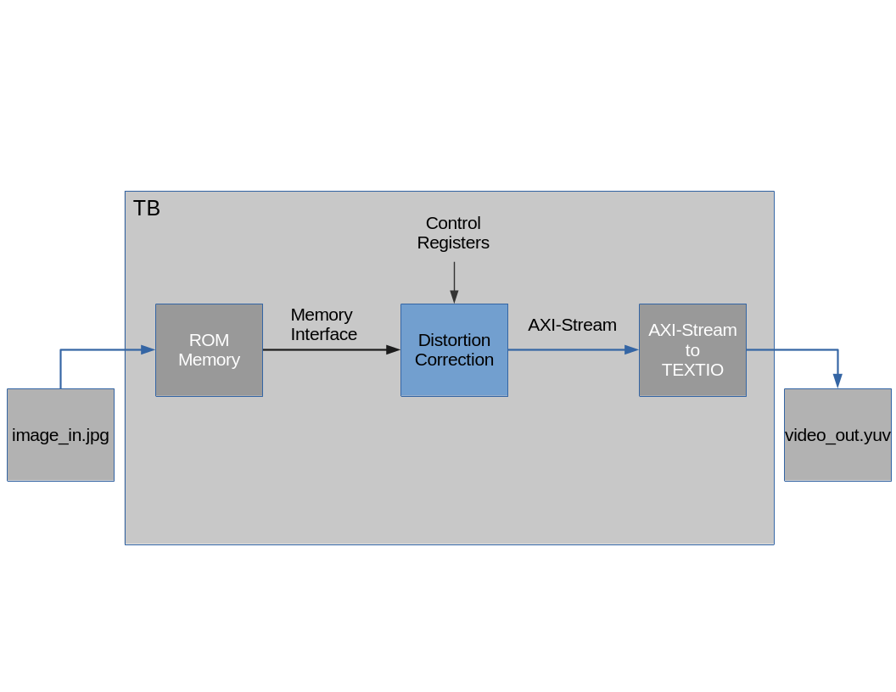

# fpga_distortion_correction

### Directories:
The following is a description of directories:
+ docs : Documents folder
+ rtl  : RTL Logic
+ tb   : Testbench
+ scripts: testbench scripts
+ sim  : Modelsim and verification files
+ pictures: Contains sample images
+ c\_model: cpp module

### Prerequisites
The following are list of tools required to run the project

+ Modelsim 2021.1
+ Vivado 2020.1
+ FFplay
+ FFmpeg
+ OpenCV
+ Make
+ Cmake

Generate vivado simulation libraries for modelsim and install in ````/opt/xilinx_sim_lib/```` directory.

### Cpp Model
The following are the steps to compile the opencv model:
1) Navigate to c\_model
2) Run cmake command: ````cmake .````
3) Run make command: ````make````
4) Execute program: ````./dist````

### Modelsim Simulation
Running the simulation:

1) Clean and setup the directory (```` make clean setup ````)
2) Run the simulation (```` make sim ````)
3) Display the corrected image (```make display```)

You can also display the waveform by running ```` make waves ```` or run in GUI mode using the command ```` make sim GUI=1 ````

### Testbench Architecture



